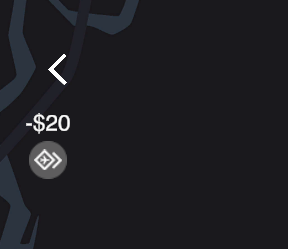

# Airways CEO

A Mini Airways mod allows you to purchase upgrades and refresh upgrade options actively. Each hand-over/landing gets you two times the point worth of cash. Current cash is displayed on the lower-right.

Use the button on the bottom right corner to purchase upgrade directly, or press `Left SHIFT` + numbers `1` ~ `9` to purchase upgrade directly. 

| `LShift`+`1`     | `LShift`+`2` | `LShift`+`3`   | `LShift`+`4` | `LShift`+`5`     | `LShift`+`6` | `LShift`+`7`  | `LShift`+`8`   | `LShift`+`9`   |
|------------------|--------------|----------------|--------------|------------------|--------------|---------------|----------------|----------------|
|   Waiting Area   |   Exit       |   Turn Speed   |   Airspace   |   Compensation   |   Waypoint   |   Holding WP  |   Landing WP   |   Takeoff WP   |
|   $30            |   $40        |   $30          |   $30        |   $30            |   $30        |   $40         |   $50          |   $50          |

Use the button on the top left corner or press `B` to buy an random upgrade (-$20) and use the button on the right of upgrade list or press `R` to refresh the upgrade list (-$5).

    
    &nbsp; &nbsp; &nbsp;
    

# How to Install

- Switch the game to `mod_feat` [branch](https://partner.steamgames.com/doc/store/application/branches?) on Steam.
- Copy [AirwaysCEO.dll](https://github.com/ericpzh/AirwaysCEO/blob/main/bin/Debug/netstandard2.1/AirwaysCEO.dll) into `<path_to_game>\Mini Airways\BepInEx\plugins`

***

# 空管CEO

一个能让你购买升级的迷你空管Mod。每次起飞降落可以获得2倍分数的钱。右下角可以查看当前余额。

用画面右下角的按键直接购买升级，也可以用 `Left SHIFT` + 数字键`1` ~ `9`直接购买升级。

| `LShift`+`1`     | `LShift`+`2` | `LShift`+`3`   | `LShift`+`4` | `LShift`+`5`     | `LShift`+`6` | `LShift`+`7`  | `LShift`+`8`   | `LShift`+`9`   |
|----------|----------|----------|----------|----------|----------|----------|----------|----------|
| 等待区   | 出口     | 转弯速度 | 空域     | 赔偿     | 航点     | 盘旋航点 | 降落航点 | 起飞航点 |
| $30      | $40      | $30      | $30      | $30      | $30      | $40      | $50      | $50      |

用画面左上角的按键或按`B`购买一项随机升级（-$20），按升级列表右边的按键或按`R`刷新升级列表（-$5）。

    
    &nbsp; &nbsp; &nbsp;
    

# 如何安装

- 右键库中的Mini Airways，[属性 - 测试版 - mod_feat](https://partner.steamgames.com/doc/store/application/branches?l=schinese), 更新。
- 复制[AirwaysCEO.dll](https://github.com/ericpzh/AirwaysCEO/blob/main/bin/Debug/netstandard2.1/AirwaysCEO.dll) 到 `<path_to_game>\Mini Airways\BepInEx\plugins`。
